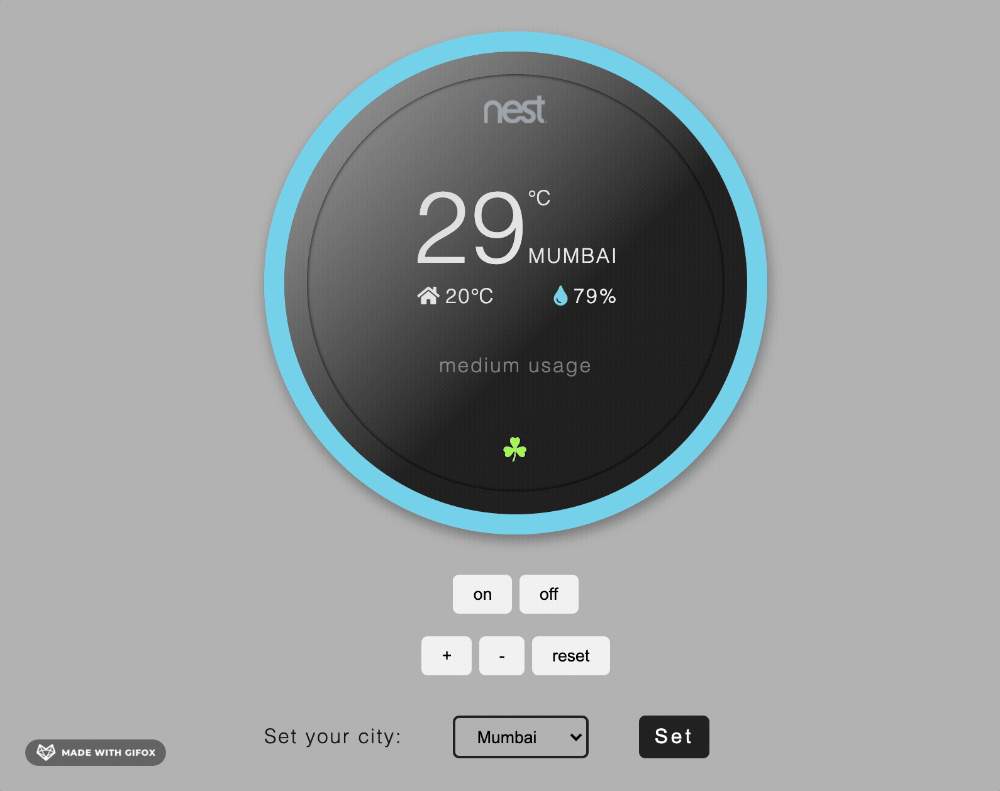

## Thermostat Challenge

Built a thermostat with JavaScript, following test-driven development (Jasmine).

Uses weather information from the [Open Weather Map API](https://openweathermap.org/current).

#### Features:

- Thermostat starts at 20 degrees
- You can increase the temperature with an up function
- You can decrease the temperature with a down function
- The minimum temperature is 10 degrees
- If power saving mode is on, the maximum temperature is 25 degrees
- If power saving mode is off, the maximum temperature is 32 degrees
- Power saving mode is on by default but it can also be turned off
- You can reset the temperature to 20 with a reset function
- You can ask about the thermostat's current energy usage: < 18 is `low-usage`, <= 25 is `medium-usage`, anything else is `high-usage`.
(low-usage will be indicated with green, medium-usage indicated with black, high-usage indicated with red.)

#### Demo

### Set up

- Clone this repository.
- View the `index.html` file in your browser.
- Create a unique API key on [Open weather map](https://openweathermap.org/api).
- Add the API key on Line 57 of the `script.js` file.
